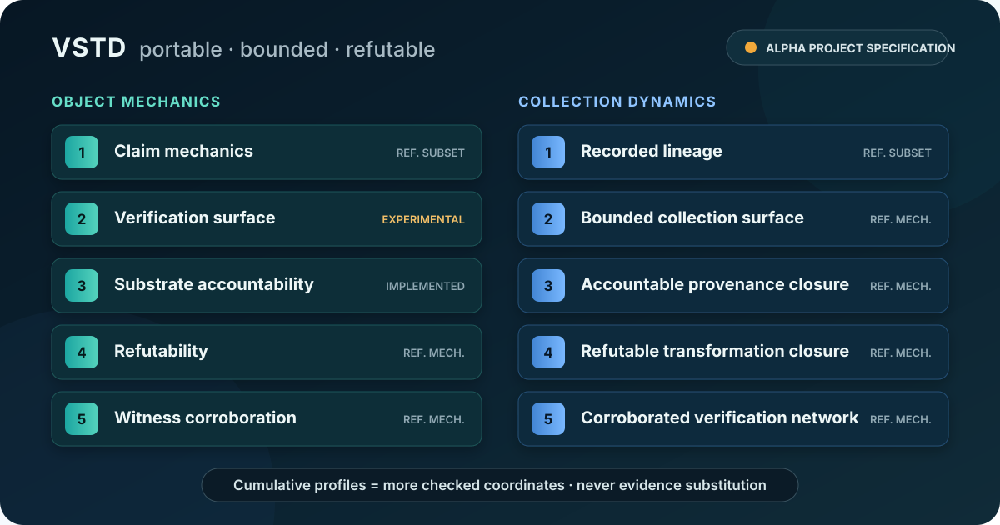

<div align="center">



# VSTD

**Portable, bounded, refutable evidence for computational claims.**

[](https://github.com/TimeLordRaps/verifier/actions/workflows/ci.yml)
[](https://github.com/TimeLordRaps/verifier/releases/latest)
[](https://www.python.org/)
[](LICENSE)
[](#project-status)

*A PASS is not enough. Show what passed, under which meaning, against which
evidence, inside which bounds, and how somebody else can prove it wrong.*

VSTD gives different verification tools a shared way to say **what they checked,
how they checked it, where the result stops, and what would overturn it**. Verification
time is limited, so the roadmap also asks a practical next question: **what should we
check first?** The intended direction is to record why verification work was selected,
spend bounded verification effort where it matters most, and make artifacts easier to
check and refute—without turning priority, confidence, or a tool's native result into a
stronger claim than the evidence supports.

[Run the demo](#see-it-fail-correctly) ·
[Read the quickstart](docs/QUICKSTART.md) ·
[Inspect the standard](standard/LADDER.md) ·
[Explore concepts and precedents](docs/CONCEPTS_AND_PRECEDENTS.md) ·
[Challenge a claim](https://github.com/TimeLordRaps/verifier/discussions/8) ·
[See the roadmap](ROADMAP.md)

</div>

## See it fail correctly

```bash
git clone https://github.com/TimeLordRaps/verifier.git
cd verifier
python -m pip install .
vstd demo
```

The side-effect-free flagship demo runs four adversarial specimens. Abridged output:

```text
VSTD flagship adversarial demo
4/4 scenarios behaved as required.
[DEMO OK] Valid-looking proof, wrong artifact          → REJECTED
[DEMO OK] Bound exhausted without a false answer       → ACCEPTED/UNKNOWN
[DEMO OK] Inflated verification-cost claim             → REJECTED
[DEMO OK] Revoked ancestor behind valid descendants    → GRAPH-LEVEL-0
```

These are bounded checks over included specimens—not evidence of empirical truth,
complete provenance, external adoption, or general AI safety. Run `vstd demo --json`
for the complete machine-readable results or `vstd demo --emit-specimens PATH` to
emit each specimen.

## What VSTD adds

VSTD is a verification domain language and interchange layer. It does not replace domain
verifiers, proof engines, signatures, identity systems, transparency logs, or provenance
formats. Those systems keep producing their native results; VSTD standardizes the claim
boundary and portable result semantics used to map them across systems without silently
upgrading what they establish.

Ordinary computational results often omit machine-readable answers to four questions:

1. **What exactly was claimed?** The subject, predicate, parameters, and limits.
2. **Which exact evidence supports it?** Digests, mechanisms, provenance, and trust roots.
3. **Where does the verdict stop?** Explicit coordinates and resource bounds.
4. **How can it change?** Reproduction, counterexample, challenge, and degradation rules.

VSTD stores those answers in receipts and provenance hypergraphs. The reference
implementation can validate stable receipt content, reproduce declared mechanisms,
check grounded decision certificates, and compute collection-level ceilings from
recorded ancestry and caller-supplied object and edge ratings.

## Two axes; evidence never substitutes

Specification numbers identify verification depth, not revisions. Every row is a
different question with its own evidence. A higher-layer result does **not** supply,
imply, upgrade, or repair a lower-layer result.

| Depth | VSTD object mechanics | VSTD-Graph collection dynamics |
|---:|---|---|
| 1 | Claim mechanics | Recorded lineage |
| 2 | Verification surface | Bounded collection surface |
| 3 | Substrate accountability | Accountable provenance closure |
| 4 | Refutability | Refutable transformation closure |
| 5 | Witness corroboration | Corroborated verification network |

An aggregate depth of `N` is valid only when distinct evidence passes every layer from
1 through `N`. Layers 1–4 are self-discernable; layer 5 requires another party to
exist, act, and be independent. VSTD-5 and its witness protocol remain **DRAFT**.

Start with [`standard/LADDER.md`](standard/LADDER.md). Wire identifiers are frozen
separately in [`standard/WIRE_IDENTIFIERS.md`](standard/WIRE_IDENTIFIERS.md).

## Choose a path

| If you want to… | Start here |
|---|---|
| Understand the claim model in ten minutes | [`docs/QUICKSTART.md`](docs/QUICKSTART.md) |
| Try to break the core claim | [`examples/flagship_demo`](examples/flagship_demo) |
| Inspect a disclosure-bounded closed evaluation | [`examples/simulacrabench_synthetic`](examples/simulacrabench_synthetic) |
| Implement an independent checker | [`standard/VSTD-4.md`](standard/VSTD-4.md) and [`VSTD4-GDC-1` schema](receipts/schema/vstd4_certificate.json) |
| Model a provenance collection | [`standard/VSTD-Graph-1.md`](standard/VSTD-Graph-1.md) |
| Record and allocate bounded experimental work | [`docs/profiles/experimental-workflow.md`](docs/profiles/experimental-workflow.md) and [`experiments/INDEX.md`](experiments/INDEX.md) |
| Integrate accelerator evidence | [`docs/layers/vstd-3/vendor-integration.md`](docs/layers/vstd-3/vendor-integration.md) |
| Use VSTD beside existing supply-chain/provenance systems | [`docs/ECOSYSTEM.md`](docs/ECOSYSTEM.md) |
| Review exact public claim limits | [`docs/CLAIMS_AND_LIMITS.md`](docs/CLAIMS_AND_LIMITS.md) |

The experimental workflow profile has an offline, verdict-neutral CLI surface:

```bash
vstd experiment validate experiments/github_verdict_neutrality/experiment.json --json
vstd experiment github-events examples/experimental_workflow/github_snapshot.json --json
```

Neither structural validity nor a successful platform event grants a VSTD verdict.

## Capture a generic computation

**Security boundary:** a manifest contains an executable command. `vstd run` does not
sandbox it. Inspect the plan first; run only a trusted manifest inside an operating
system or container boundary appropriate to that command. Declared-path checks expose
capture scope, not everything the subprocess can access.

```bash
vstd plan examples/generic_run/manifest.json --json
vstd run examples/generic_run/manifest.json --output /tmp/vstd-receipt
vstd inspect /tmp/vstd-receipt
vstd validate /tmp/vstd-receipt
vstd reproduce /tmp/vstd-receipt --rerun
```

`validate` checks stable receipt content. `reproduce --rerun` executes the recorded
command again when permitted and compares the declared outputs. Neither operation
widens the receipt into a claim about the unobserved world.

## The grounded certificate

`VSTD4-GDC-1` binds a decision to the claim and evidence it is supposed to describe:

```text
DecisionCertificate
├── header       verdict, tightest cost tier, counts, binding digest
├── formula      normalized finite clauses
├── grounding    variables → facts; clauses → named encoding rules
├── decision     model, proof, witness, or bounded UNKNOWN transcript
└── hints        untrusted, optional, and strippable
```

The checker rejects over-budget headers before proof work, rejects cost-tier inflation,
checks grounding before the decision block, and preserves `UNKNOWN` when a declared
bound is exhausted. `VSTD4-GDC-1` is a VSTD project format; reference-kernel acceptance
is not external validation.

## Install and command names

The distribution name is `verifier-standard`; the base install has no required
third-party runtime dependencies.

```bash
python -m pip install "verifier-standard==1.2.0"
python -m pip install .
python -m pip install ".[yaml]"        # YAML manifests
python -m pip install ".[jsonschema]"  # schema validation
python -m pip install ".[llguidance]"  # optional constraint adapter
python -m pip install ".[torch]"       # optional tensor adapter
```

`vstd` is the canonical cross-platform command. `verifier` remains an alias, but an
unqualified `verifier` command on Windows commonly resolves to Windows Driver Verifier.
`verifiable` remains a permanent compatibility alias because published project receipts
may bind it in falsification instructions.

An unrelated PyPI distribution named `verifier` exports the same top-level Python
import. Do not co-install it with `verifier-standard`: Python packaging does not prevent
two distributions from overwriting one import package. Install this project by its full
distribution name and use `vstd` as the command.

## Verify a release

Release assets include an external manifest binding the exact public source ref,
commit, archive digest, file set, and member bytes. The release builder produces a
platform-independent canonical source ZIP, wheel, and source distribution from that
source coordinate. CI independently builds the full set on Windows and Linux and fails
unless every artifact is byte-identical.
GitHub/Sigstore artifact attestations bind the ZIP, wheel, source distribution, and
manifest to the release workflow:

```bash
gh attestation verify PATH_TO_DOWNLOADED_ASSET --repo TimeLordRaps/verifier
```

Release notes report the tag-signature status separately. An artifact attestation is
not a tag signature. The signed `v1.1.2` GitHub release was not uploaded to PyPI because
its Windows and Linux builds differed. PyPI publication now requires the cross-platform
equality gate plus approval in the protected `pypi` environment. See
[`RELEASING.md`](RELEASING.md) for the complete gate.

## Project status

VSTD is a founder-maintained **alpha project specification**. There is no demonstrated
external adoption, independent implementation, interoperability deployment, or
third-party security review. It is not an accredited, consensus, IETF, ISO, or W3C
standard. A `VERIFIED` result is always relative to declared coordinates, evidence,
mechanisms, bounds, and trust roots.

Current public-review priorities are counterexamples to normative statements,
ambiguous wire rules, independent parser results, interoperability failures, and
receipts that pass when they should fail. Use the
[issue forms](https://github.com/TimeLordRaps/verifier/issues/new/choose). Send sensitive
findings through [`SECURITY.md`](SECURITY.md), not a public issue.

VSTD may improve auditability, reproducibility, incident analysis, and challenge
propagation over observable records. It cannot prove general AI safety, reveal hidden
model internals, establish physical-world completeness, or compensate for missing
instrumentation.

## Project process

- Specification order: [`LADDER`](standard/LADDER.md) → layer documents → schemas →
  independent checker → conformance tests.
- Public technical direction: [`ROADMAP.md`](ROADMAP.md).
- Contribution rules: [`CONTRIBUTING.md`](CONTRIBUTING.md).
- Automated-contributor rules: [`AGENTS.md`](AGENTS.md).
- Governance and release authority: [`GOVERNANCE.md`](GOVERNANCE.md).
- Security and disclosure: [`SECURITY.md`](SECURITY.md).
- Release construction and attestations: [`RELEASING.md`](RELEASING.md).

Apache License 2.0. See [`LICENSE`](LICENSE) and [`NOTICE`](NOTICE). VSTD is not
affiliated with or endorsed by the Apache Software Foundation.
